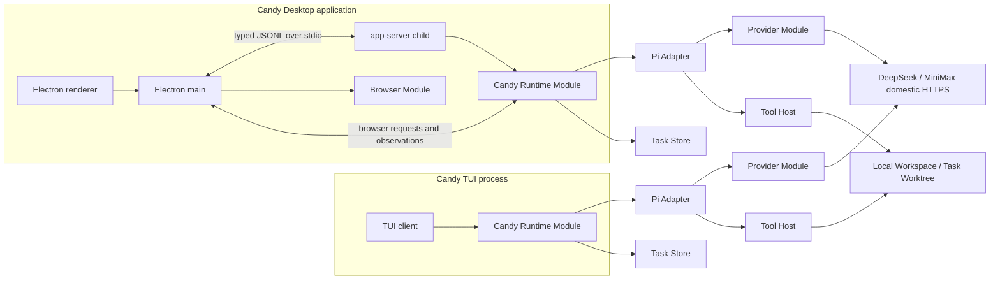
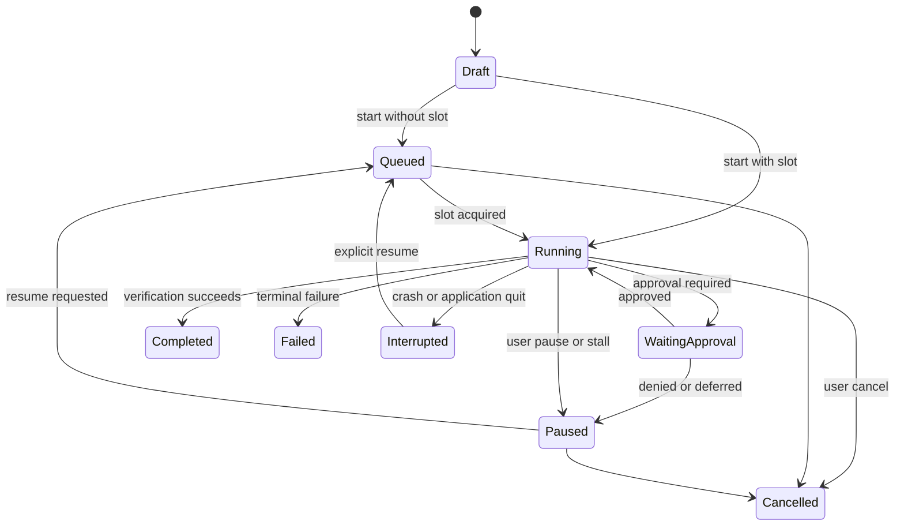

# Candy V1 Architecture

Status: accepted; concrete adapters remain compatibility-gated

This document turns the accepted Candy V1 product decisions into a small set of deep modules and stable seams. It defines the target architecture and delivery order. The selected implementation shape is in [the technical plan](technical-plan-v1.md), the staged coding work is in [the implementation plan](implementation-plan-v1.md), and external evidence is recorded in the [provider/Pi](../research/compatibility-gate-0.md) and [platform](../research/platform-gate-0.md) Gate reports.

Interactive Archify views: [system architecture](../diagrams/candy-system-architecture.html), [runtime modules](../diagrams/candy-runtime-modules.html), [task turn sequence](../diagrams/candy-task-turn-sequence.html), [Auto Debug workflow](../diagrams/candy-auto-debug-workflow.html), and [task lifecycle](../diagrams/candy-task-lifecycle.html). JSON sources and regeneration instructions are in the [diagram index](../diagrams/README.md).

## Architectural outcomes

- Candy runs independently of Codex, OpenCode, and any separately installed Pi CLI.
- TUI and Desktop share one runtime interface and normalized event model.
- Pi remains an internal agent engine behind a narrow adapter.
- One task has one agent, one session, one Primary Model, and one execution owner.
- Independent tasks may run concurrently; mutable operations inside one task remain sequential by default.
- Provider credentials remain inside the trusted credential and provider path.
- Browser automation is a task capability, not a browser implementation or a second agent runtime.
- Auto Debug is a long-running task policy on the normal agent loop, not a workflow engine.

## System view



The repeated runtime blocks represent the same package running in different process topologies. They do not share in-memory state.

## Process model

### TUI

The TUI creates the Candy Runtime Module in-process. It renders normalized events and resolves approval requests directly. It does not launch Pi interactive mode and does not require the Desktop app-server.

### Desktop

Electron main owns the window lifecycle, renderer bridge, Browser Module, OS integration, and app-server child. The app-server runs under the same packaged Pi-compatible Node runtime as TUI, rather than Electron's embedded Node, and owns the task scheduler and one runtime instance for every executing task. Electron main and the app-server communicate only through versioned JSONL over stdio.

Closing the window leaves Electron main and the app-server alive in the tray or menu bar. Explicit application quit cancels active work, persists interruption state, and terminates the child. The child may never become a system-wide daemon or survive its parent application.

The renderer has no direct Node.js, filesystem, credential-store, CDP, or app-server access. Electron main exposes narrow allowlisted operations through `contextBridge` with context isolation and renderer sandboxing enabled.

## Module map

### Candy Runtime Module

The Candy Runtime Module is the external seam used by both clients. Its interface has three operations:

```ts
interface CandyRuntime {
  dispatch(command: RuntimeCommand): Promise<CommandReceipt>;
  events(options?: EventCursor): AsyncIterable<RuntimeEvent>;
  snapshot(query: SnapshotQuery): Promise<RuntimeSnapshot>;
}
```

The interface includes command ordering, cancellation, error semantics, and event sequencing. Its implementation hides scheduling, task ownership, Pi, provider gates, sessions, tools, permissions, workspaces, long-running policies, and recovery.

The TUI calls this interface directly. Desktop uses a JSONL transport adapter around the same interface. This is a real seam because it has in-process, stdio, and in-memory test adapters.

### Task Engine Module

The Task Engine is internal to the runtime and owns one Candy Task. It binds one session, Primary Model, workspace lease, permission profile, cancellation scope, and optional long-running completion policy to one Pi agent instance.

The Task Engine emits only normalized Candy events. Pi messages, tool types, session paths, and provider-specific payloads do not cross its interface.

### Pi Adapter

The Pi Adapter is the only implementation allowed to import Pi packages. It translates between Candy inputs/events and Pi's public agent, model, tool, and session contracts. It does not expose Pi types to clients or other packages, fork Pi, run Pi interactive mode, or reimplement the agent loop.

Pi version changes require adapter contract tests and macOS `26.5.2` Apple Silicon/Windows 11 session compatibility tests before the lockfile changes.

### Provider Module

The Provider Module hides model catalogs, approved endpoints, authentication, streaming, tool-call compatibility, thinking settings, provider concurrency gates, rate limiting, and attachment encoding behind one internal interface:

```ts
interface ModelProvider {
  stream(request: ModelRequest, sink: ModelEventSink, signal: AbortSignal): Promise<ModelResult>;
}
```

DeepSeek and MiniMax are production adapters; an in-memory deterministic adapter is used for tests. `ModelRequest` contains a model selection and attachment identifiers, never a credential.

The provider implementation obtains a short-lived secret lease from the Credential Broker, sends it only as authentication to the approved HTTPS endpoint, and releases it after the request. It never places the secret in prompts, sessions, logs, events, tool arguments, browser messages, or child-process environments.

DeepSeek V4 Flash is the default model. DeepSeek V4 Pro and MiniMax M3 are explicit alternatives. A task may switch between turns; the Provider Module never performs silent fallback.

### Tool Host Module

The Tool Host exposes one execution interface to the Task Engine:

```ts
interface ToolHost {
  execute(call: ToolCall, context: ToolContext, signal: AbortSignal): Promise<ToolOutcome>;
}
```

Its implementation owns sandbox checks, approval requests, mutation serialization, command cancellation, clean subprocess environments, secret scanning, file-change tracking, browser dispatch, and structured errors. Pi file and shell tools remain implementation details behind this interface.

Reads and searches may execute in parallel. File mutations, shell commands, Git mutations, and browser actions that can conflict are serialized within a task. Independent Task Worktrees may execute concurrently.

### Workspace Module

The Workspace Module owns Local Workspace leases, Task Worktrees, execution locks, Handoff, Apply Changes, conflict detection, and cleanup. Its interface deals in task and workspace identifiers rather than raw Git command sequences.

Git tasks may use Local or an associated Task Worktree. Concurrent writable tasks for one repository require separate worktrees. Apply Changes always produces reviewed, uncommitted changes and stops on a dirty target or conflict.

Non-Git tasks operate directly in Local and permit one writer. They have no worktree or Handoff capability; the module still records file changes for review.

### Task Store Module

The Task Store owns Candy metadata, Pi-backed sessions, attachment metadata and blobs, task state, queue order, and interruption markers in the Candy application-data directory. It never uses Pi's default session directory.

Session records refer to attachments by identifier and metadata. Binary image or video content is stored separately and never embedded in session JSONL. Credentials and complete browser authentication values are never stored in task data.

Only completed messages and tool results are resumable. A crash during a tool call records an interruption; resuming starts a new turn and never replays an uncertain side effect automatically.

### Browser Module

Electron main owns the Browser Module because it owns the visible embedded Chromium surface, persistent Browser Profile, downloads, and CDP access. The app-server receives a Browser adapter over the Desktop transport seam. TUI tasks report browser capability as unavailable.

The Browser Module interface remains small:

```ts
interface TaskBrowser {
  open(request: BrowserOpen): Promise<BrowserObservation>;
  observe(request: BrowserObserve): Promise<BrowserObservation>;
  act(request: BrowserAction): Promise<BrowserObservation>;
  setControl(request: BrowserControlChange): Promise<void>;
  close(request: BrowserClose): Promise<void>;
}
```

`BrowserObservation` contains a tab identifier, URL, title, monotonic revision, structured page outline, and optional screenshot attachment identifier. It never contains cookies, saved passwords, authentication headers, or raw credential-store values. Every action references the observation revision; stale actions fail instead of targeting a changed page.

The Browser Module owns site permission and sensitive-action confirmation. Verified physical user input immediately changes control to the user and cancels a conflicting agent action. If packaged Electron cannot distinguish physical from synthesized input reliably, the visible Take Control action performs that transfer. Full CDP inspection requires separate approval. Automated uploads are unavailable in V1; downloads remain visible and use a configured destination.

The selected V1 implementation is Electron `WebContentsView` plus a persistent Electron Session, `DownloadItem`, and a thin allowlisted `webContents.debugger`/CDP adapter. Playwright may test the packaged application externally; agent-browser and browser-use are not production Browser Module dependencies.

### Platform Module

The Platform Module hides application-data paths, OS credential stores, process lifecycle, locks, platform-specific cancellation, and the Sandbox Runner protocol. Windows 11, macOS `26.5.2` Apple Silicon, and in-memory test adapters justify this seam. Product and control-plane behavior remains TypeScript; one audited Rust helper implements only native command containment and process-tree ownership. No caller may assume POSIX paths, signals, permissions, shells, or process groups.

## Commands, events, and transport

Runtime commands and events are discriminated TypeScript unions with runtime validation. Desktop JSONL envelopes include protocol version, command or event identifier, task identifier when applicable, and a monotonic per-task event sequence.

```json
{"v":1,"id":"cmd_123","type":"task.start_turn","taskId":"task_123","payload":{"inputId":"input_123"}}
{"v":1,"seq":42,"type":"tool.started","taskId":"task_123","payload":{"toolCallId":"call_123","kind":"shell"}}
```

The protocol never carries credentials or binary attachments. Large and binary inputs are referenced by identifiers in the Candy application-data directory. Event cursors plus runtime snapshots allow a client to recover from a dropped stream without replaying commands.

Browser requests between app-server and Electron main use the same versioned envelope discipline but are not exposed directly to the renderer. The renderer receives presentation-safe projections only.

## Task lifecycle



Only Running tasks consume an execution slot. A task has exactly one execution owner. Persisted Queued, Paused, and Interrupted tasks never resume silently after restart.

## Long-running tasks and Auto Debug

Long-running behavior is a completion policy inside the Task Engine. It adds an explicit outcome, validator, progress evidence, optional budget, and stop reasons to the normal Pi-driven turn loop. It does not introduce another scheduler or tool system.

Auto Debug follows this sequence:

1. reproduce the failure with an explicit command, test, build, or browser assertion;
2. record observable evidence;
3. let the normal agent loop inspect and modify the workspace;
4. rerun the same validator;
5. complete on success or pause on approval, stall, budget, ownership loss, or user stop.

The user may steer, pause, resume, or cancel the task. Long-running execution retains the same model, workspace, sandbox, command network, browser, and site permissions. It cannot commit, push, release, or deploy without the ordinary explicit approvals, and V1 never performs those actions automatically.

## Credential path

The renderer writes or replaces a provider credential through a dedicated, non-observable Electron credential bridge. This bridge is not part of the runtime command/event protocol, is excluded from diagnostics and logging, and returns only success or presence state. Complete credentials are never readable through the renderer interface.

Desktop app-server and TUI Provider Modules resolve credentials from a temporary provider-specific process environment or the OS credential store through the Credential Broker. The Tool Host creates subprocess environments from an allowlist and strips every active provider credential and provider-specific secret variable.

Provider endpoint allowlists are code-owned configuration. MiniMax credentials and attachments may authenticate only to `https://api.minimaxi.com`; there is no global fallback.

## Persistent data

The Platform Module resolves all paths under the Candy application-data root. The logical layout is:

```text
Candy app data
  tasks/<task-id>/metadata
  tasks/<task-id>/session
  tasks/<task-id>/attachments/<attachment-id>
  locks/<task-id>
  worktrees/<task-id>/
  browser-profile/
```

The logical names are stable; exact filenames and platform paths are implementation details. Provider credentials live only in the OS credential store or approved temporary process environment, never in this tree.

## Delivery slices

1. **Runtime proof**: pin Node, package manager, Pi packages, and DeepSeek V4 Flash contract; stream one response; run one read-only tool; save and reload a session; prove credential isolation.
2. **Task runtime**: implement normalized commands/events, Task Store, task ownership, cancellation, and TUI over the in-process interface.
3. **Model portfolio**: add DeepSeek V4 Pro, MiniMax M3, image attachments, provider gates, and no-fallback behavior.
4. **Desktop shell**: add Electron renderer/main, app-server child, typed JSONL adapter, credential bridge, task list, approvals, and diff review.
5. **Workspace concurrency**: add queueing, Task Worktrees, Local/Worktree Handoff, non-Git single-writer behavior, and recovery.
6. **Browser Workspace**: add the visible browser, persistent profile, site permissions, observation/actions, takeover, screenshots, and browser validation.
7. **Long-running tasks**: add explicit completion criteria, pause/resume/steering, validators, stall detection, optional budgets, and Auto Debug.

Each slice must pass on macOS `26.5.2` Apple Silicon and Windows 11 before the next slice can claim cross-platform support.

## Required compatibility spikes

- exact Node.js, package-manager, Pi package versions, and Pi public entrypoints;
- DeepSeek V4 Flash/Pro domestic model identifiers, thinking modes, streaming, and tool calling;
- MiniMax M3 domestic endpoint model identifier, Token Plan authentication, image schema, tool calling, streaming, cancellation, and limits;
- Electron embedded-browser control through CDP and the value, if any, of an external automation adapter;
- Windows 11 and macOS `26.5.2` Apple Silicon credential stores, locks, process cancellation, task recovery, and worktree behavior.

These spikes may change adapters and internal implementation. They must not weaken the accepted product or security invariants without a new decision.
